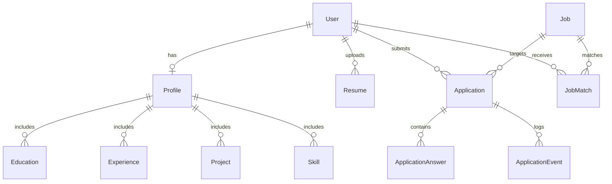

# CareerOS 🚀
### The Intelligent AI Job Application & Career Operating System

[](https://nextjs.org/)
[](https://www.typescriptlang.org/)
[](https://neon.tech/)
[](https://www.prisma.io/)
[](https://openai.com/)
[](https://www.emailjs.com/)
[](https://vercel.com/)

---

## 🌟 Overview

**CareerOS** is a production-grade, full-stack AI career operating system built to streamline the entire job search and application lifecycle. It automates candidate resume parsing, job ingestion from web URLs, semantic qualification matching, tailored answer generation, and applicant tracking—all underpinned by **strict human-in-the-loop authorization gates** and **zero-hallucination fact grounding**.

Unlike generic form-fillers or untrusted AI tools, CareerOS never fabricates qualifications, never submits applications without explicit candidate consent, and protects against prompt injection attacks by strictly isolating untrusted external content.

---

## 🛠️ Complete Tech Stack & Tools Used

CareerOS was engineered with a modern, high-performance architecture:

### 1. Frontend & User Experience
- **[Next.js 14 (App Router)](https://nextjs.org/)**: React Server Components, client-side streaming, and layout hierarchies.
- **[React 18](https://react.dev/)**: Component architecture, optimistic UI updates, and responsive state management.
- **[TypeScript 5](https://www.typescriptlang.org/)**: Strict end-to-end type safety across client interfaces, server actions, and API payloads.
- **[Lucide React](https://lucide.dev/)**: High-fidelity iconography.
- **Modern Glassmorphism Design System**: Custom Vanilla CSS with a curated dark-slate aesthetic, fluid typography, smooth micro-interactions, and reactive status tags.

### 2. Backend & Server Engine
- **Next.js Route Handlers (`src/app/api/`)**: RESTful API endpoints for authentication, resume parsing, job analysis, profile management, and application workflows.
- **Next.js Edge Middleware (`src/middleware.ts`)**: Route protection guarding `/dashboard`, `/profile`, `/resume`, `/apply`, `/applications`, and `/api/*` against unauthenticated access with automatic redirect preservation.
- **[bcryptjs](https://github.com/dcodeIO/bcrypt.js)**: Salted password hashing (salt rounds: 10) for secure credential storage.
- **[jsonwebtoken (JWT)](https://github.com/auth0/node-jsonwebtoken)**: Cryptographically signed session tokens stored in secure, SameSite HTTP-only cookies.

### 3. Database & ORM
- **[Neon Serverless PostgreSQL](https://neon.tech/)**: Cloud-native, distributed PostgreSQL database with SSL connection pooling and high concurrency.
- **[Prisma ORM 5](https://www.prisma.io/)**: Type-safe schema definition, automated migrations, relational querying, and cascade cleanup rules.

### 4. Artificial Intelligence & Prompt Safety
- **[OpenAI API (GPT-4o / GPT-4o-mini)](https://platform.openai.com/)**:
  - **Resume Fact Extraction**: Converts raw resume text into structured education, experience, projects, and skills.
  - **Job Requirement Analyzer**: Identifies required technical proficiencies, qualifications, and role expectations.
  - **Fact-Grounded Answer Generation**: Formulates custom application answers strictly grounded in the candidate's verified profile data.
- **Prompt Injection Defense System**: All untrusted external inputs (scraped job text, uploaded resumes) are wrapped in explicit boundary tags (`<untrusted_resume_content>` and `<untrusted_job_posting_data>`) with system instructions forbidding command execution.

### 5. Document & File Parsers
- **[pdf-parse](https://www.npmjs.com/package/pdf-parse)**: Extracts raw, uncorrupted text buffers from uploaded PDF resumes.
- **[mammoth](https://www.npmjs.com/package/mammoth)**: Translates uploaded Word documents (`.docx`) into clean plain text for AI ingestion.

### 6. Web Scraping & ATS Ingestion Engine
- **[Cheerio](https://cheerio.js.org/)**: Server-side DOM parser for extracting OpenGraph metadata, structured ATS containers, and page bodies.
- **Direct ATS API Parsers**:
  - **Greenhouse API** (`boards-api.greenhouse.io`): Directly fetches job title, company, clean description, and question fields.
  - **Lever API** (`api.lever.co`): Direct API extraction for Lever postings.
  - **Ashby API**: Public endpoint querying for Ashby postings.
- **Schema.org JSON-LD Parser**: Automatically extracts `<script type="application/ld+json">` `JobPosting` metadata—bypassing client-rendered JavaScript shells on corporate boards (LinkedIn, Workday, Indeed).

### 7. Transactional Email & Authentication Security
- **[EmailJS REST API](https://www.emailjs.com/)**: Dispatches dynamic 6-digit OTP verification codes and password reset links to user email inboxes, equipped with dynamic Origin header support for Node server execution.

---

## ⚡ What CareerOS Does (Core Capabilities)

### 1. Secure Account Lifecycle & Email Verification
- **Email Verification Gate**: New registrations require a 6-digit verification code delivered via email. Accounts remain unactivated until verified; expired or reused codes are rejected.
- **Live Password Reset**: `/forgot-password` and `/reset-password` flow with time-limited reset tokens, account verification validation, and password hash updates.
- **Route Protection**: Unauthenticated users cannot view sensitive candidate data or trigger API operations.

### 2. Resume Upload & Human Confirmation Gate
- Upload resumes in **PDF** or **DOCX** format (up to 10MB).
- AI parses and extracts candidate **Education**, **Experience**, **Projects**, and **Skills**.
- **Human Confirmation Gate**: Candidates review and edit extracted items before anything is saved to the database, ensuring zero AI hallucinations enter the candidate's authoritative profile.

### 3. "Apply For Me Through The URL" Job Ingestion
- Simply paste any job posting URL.
- The engine identifies the ATS (Greenhouse, Lever, Ashby, Workday, etc.), invokes direct APIs or parses Schema.org JSON-LD, and extracts:
  - Role Title & Company
  - Location & Workplace Type (Remote / Hybrid / Onsite)
  - Full Job Description & Requirements
  - Direct Application Submission URL
- Built-in fallback diagnostics prompt the user to paste the description if a site blocks external scrapers.

### 4. Deterministic & Semantic Matching Engine
- Compares job requirements against the candidate's verified profile facts.
- Calculates an objective **Match Score (0–100%)**.
- Categorizes candidate standing:
  - 🟢 **Definitely qualifies**
  - 🔴 **Definitely does not qualify**
  - 🟡 **Unclear / needs confirmation**
- Identifies matching strengths and flags missing technical proficiencies.

### 5. Recommended & Matched Jobs Dashboard
- View all matched jobs with match scores and skill breakdowns.
- **Dismiss & Delete Recommendations**: Candidates can delete any unwanted recommendation or match directly from the dashboard with one click, updating the database in real-time.

### 6. Fact-Grounded Answer Generation Studio
- Generate tailored answers to application questions (e.g., *"Why are you interested in this role?"*, *"Describe a challenge you solved"*).
- Every answer is synthesized **strictly from verified candidate milestones**—with clickable fact badges showing exact grounding sources.
- Candidates can edit, regenerate, or approve answers.

### 7. Human-in-the-Loop Pre-Submission Verification Gate
- Comprehensive pre-submission review showing applicant information, target job, and generated responses.
- **Strict Legal Authorization Checkbox**: Candidates must explicitly check:
  > *"I confirm that the information above is accurate and I authorize this application to be submitted."*
  Submissions without this checkbox are rejected by the server with HTTP 400.

### 8. Application Tracker & Auto-Apply Engine
- Manage applications across states: `SAVED`, `PREPARING`, `READY_FOR_REVIEW`, `SUBMITTED`, `INTERVIEW`, `OFFER`, `REJECTED`, `WITHDRAWN`.
- Automated ATS payload mapping (First Name, Last Name, Email, Phone, LinkedIn, GitHub, Resume, Answers).
- Application deletion with database cascade (cleans up associated answers and audit events).
- Chronological audit logging (`ApplicationEvent`) tracking every state change.

---

## 🗄️ Relational Database Schema



### Key Models:
- **`User`**: Core authentication record (email, salted password hash).
- **`EmailVerification`**: Temporary pending 6-digit OTP verification codes.
- **`PasswordResetToken`**: Secure, time-limited tokens for password resets.
- **`Profile`**: Authoritative candidate details (phone, headline, summary, links, work authorization).
- **`Resume`**: Stored resume files, extracted raw text, and structured JSON representations.
- **`Education` / `Experience` / `Project` / `Skill`**: Normalized, candidate-confirmed career data.
- **`Job`**: Ingested job postings, requirements, ATS identifiers, and source URLs.
- **`JobMatch`**: Personalized recommendation score, strengths, and missing skills.
- **`Application`**: Application state machine with status progression and timestamps.
- **`ApplicationAnswer`**: AI-generated and candidate-edited responses to application prompts.
- **`ApplicationEvent`**: Immutable chronological audit logs for every application action.

---

## 📁 Repository Structure

```
career-os/
├── prisma/
│   └── schema.prisma              # PostgreSQL schema & relationships
├── src/
│   ├── app/
│   │   ├── api/
│   │   │   ├── applications/      # Application CRUD, status, auto-apply
│   │   │   ├── auth/              # Login, register, verify, forgot/reset password
│   │   │   ├── jobs/              # Analyze, scrape, matches, delete recommendation
│   │   │   ├── profile/           # Profile CRUD & confirmation
│   │   │   └── resume/            # PDF/DOCX file upload & parsing
│   │   ├── applications/          # Application tracker dashboard
│   │   ├── apply/                 # End-to-end multi-step application workflow
│   │   ├── dashboard/             # Main hub: metrics, matches, dismiss jobs
│   │   ├── forgot-password/       # Password recovery request page
│   │   ├── login/                 # Candidate sign in
│   │   ├── profile/               # Candidate profile view & editor
│   │   ├── register/              # Sign up with OTP verification code modal
│   │   ├── reset-password/        # Password reset confirmation page
│   │   ├── resume/                # Resume upload & extraction review
│   │   ├── layout.tsx             # Root application layout with navigation
│   │   └── page.tsx               # Public landing page with feature showcase
│   ├── components/
│   │   ├── Navbar.tsx             # Dynamic navigation bar with auth state
│   │   └── Footer.tsx             # Application footer
│   ├── lib/
│   │   ├── ai/
│   │   │   └── aiService.ts       # OpenAI prompts, extraction & fact-grounding
│   │   ├── automation/
│   │   │   └── automationService.ts # ATS payload mapping & auto-apply engine
│   │   ├── email/
│   │   │   └── emailService.ts    # EmailJS OTP & password reset dispatcher
│   │   ├── parser/
│   │   │   └── fileParser.ts      # PDF & DOCX buffer decoders
│   │   ├── scraper/
│   │   │   └── jobScraper.ts      # Greenhouse/Lever/Ashby/JSON-LD scraper
│   │   ├── auth.ts                # JWT session management & bcrypt helpers
│   │   ├── constants.ts           # Application statuses & configuration
│   │   └── db.ts                  # Prisma Client singleton
│   ├── middleware.ts              # Edge middleware protecting private routes
│   └── styles/
│       └── globals.css            # Design system, glassmorphism, animations
├── .env.example                   # Environment configuration template
├── package.json                   # Dependencies & build scripts
└── tsconfig.json                  # TypeScript compiler configuration
```

---

## 🚀 Getting Started

### Prerequisites
- **Node.js**: `v18.18+` or `v20+`
- **npm** or **pnpm**
- A **Neon PostgreSQL** database instance (free tier works great)
- An **OpenAI API Key** (for parsing and answer drafting)
- An **EmailJS Account** (for sending OTP codes and reset links)

---

### Installation & Local Setup

1. **Clone the Repository**:
   ```bash
   git clone https://github.com/datnaijakid/career-os.git
   cd career-os
   ```

2. **Install Dependencies**:
   ```bash
   npm install
   ```

3. **Configure Environment Variables**:
   Create a `.env` file in the project root (see `.env.example`):
   ```env
   # Database (Neon PostgreSQL)
   DATABASE_URL="postgresql://[user]:[password]@[host]/[dbname]?sslmode=require"
   DIRECT_URL="postgresql://[user]:[password]@[host]/[dbname]?sslmode=require"

   # Authentication Secret
   JWT_SECRET="your-super-secret-jwt-key-change-in-production"

   # OpenAI API
   OPENAI_API_KEY="sk-proj-..."
   OPENAI_MODEL="gpt-4o-mini"

   # EmailJS Configuration
   EMAILJS_SERVICE_ID="service_..."
   EMAILJS_TEMPLATE_ID="template_..."
   EMAILJS_PUBLIC_KEY="public_key_..."
   EMAILJS_PRIVATE_KEY="private_key_..."
   ```

4. **Initialize Database Schema**:
   ```bash
   npx prisma generate
   npx prisma db push
   ```

5. **Start Development Server**:
   ```bash
   npm run dev
   ```
   Navigate to [http://localhost:3000](http://localhost:3000) in your browser.

---

## 🌐 Deploying to Vercel

1. **Push your repository to GitHub**.
2. **Import into Vercel**:
   - Go to [vercel.com](https://vercel.com) and click **"Add New Project"**.
   - Select your `career-os` repository.
3. **Set Environment Variables in Vercel**:
   - Under **Project Settings > Environment Variables**, add:
     - `DATABASE_URL` (Neon pooled connection string)
     - `DIRECT_URL` (Neon direct connection string)
     - `JWT_SECRET`
     - `OPENAI_API_KEY`
     - `OPENAI_MODEL`
     - `EMAILJS_SERVICE_ID`
     - `EMAILJS_TEMPLATE_ID`
     - `EMAILJS_PUBLIC_KEY`
     - `EMAILJS_PRIVATE_KEY`
4. **Deploy**:
   - Vercel will automatically run `npm run build` (which generates the Prisma client and compiles the Next.js application).
   - Your CareerOS platform will be live instantly!

---

## 🔒 Security & Privacy Commitments

- **Zero Hallucination Policy**: Answer generation is restricted to facts confirmed by the candidate.
- **Human-in-the-Loop Always**: No application can be submitted without explicit candidate authorization.
- **Password Security**: Passwords are never stored in plaintext and are hashed using bcrypt with salt rounds.
- **Strict Route Protection**: Middleware enforces authentication before granting access to candidate documents or applications.
- **Injection Isolation**: Untrusted external web content is safely sanitized and isolated before being processed by AI models.

---

## 📄 License

This project is licensed under the MIT License.
